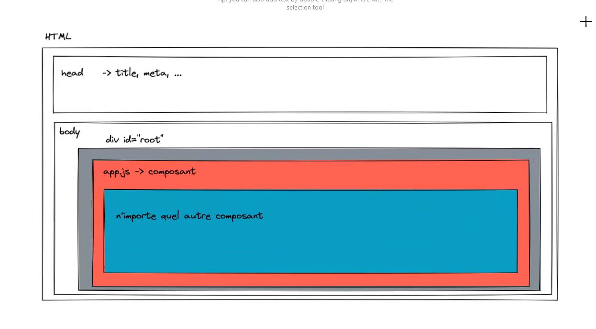

# Formation React / Redux

- [Formation React / Redux](#formation-react--redux)
  - [Npm](#npm)
    - [Commandes basiques](#commandes-basiques)
    - [Création d'un projet pré-ini](#création-dun-projet-pré-ini)
  - [Comment ça marche](#comment-ça-marche)
  - [Pratique d'organisation](#pratique-dorganisation)
  - [Heroku](#heroku)

## Npm

### Commandes basiques

- `npm init` : Pour initialiser un projet npm (Node.js).
  - Confirmer ou modifier les informations en console.
  - Cela créera un fichier package.json, avec les premières infos concernant l'utilisateur et les packages de base.
  - On peut modifier le fichier package.json, ou utiliser les commandes npm.
- `npm install nomDuPackage` : Installer des packages pour le projet spécifiques pour le projet.
- `npm install -dev nomDuPackage` : Installer des packages spécifiques pour la phase de développement (ne seront pas publier par la suite)
- `npm install` : Installer les packages listés par `package.json`
- `npm remove nomDuPackage` -> Supprimer un package de `node_modules` et du `package.json`

> result : [demo-node](demo-node)

### Création d'un projet pré-ini

- `npx create-react-app nomDuProjet` : Va créer toute une structure de fichier avec des packages pré-installés.

> result : [react-poe-java](react-poe-java)

## Comment ça marche

## Pratique d'organisation

- Les "composants" qui n'ont pas d'url (par exemple, logo.js), vont dans "Components"
- Sinon, s'il y a un url derrière : dans "Pages"

## Heroku

Pour déployer sur heroku, du root ou d'un subdir, suivre les liens :
- [https://devcenter.heroku.com/articles/getting-started-with-nodejs?singlepage=true#set-up](https://devcenter.heroku.com/articles/getting-started-with-nodejs?singlepage=true#set-up)
- [https://elements.heroku.com/buildpacks/timanovsky/subdir-heroku-buildpack](https://elements.heroku.com/buildpacks/timanovsky/subdir-heroku-buildpack)

> result : [https://boiling-mountain-41758.herokuapp.com/](https://boiling-mountain-41758.herokuapp.com/)